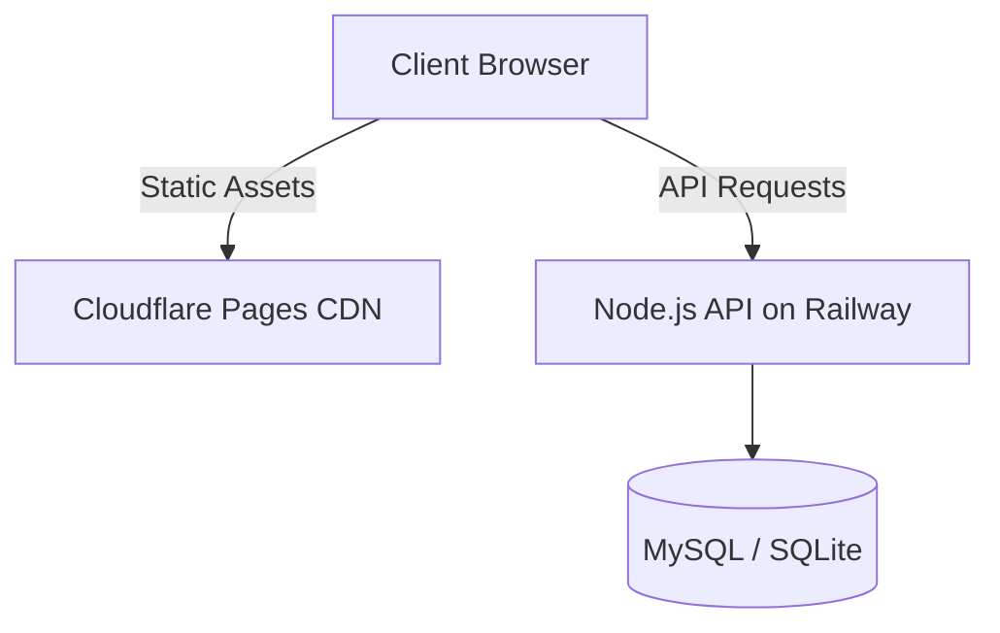

# Cloudflare Pages Deployment Guide (VIAN ERP)

This guide documents the architecture, automated deployment pipeline, manual build procedures, rollback strategies, and troubleshooting steps for the **VIAN ERP** Flutter Web frontend on **Cloudflare Pages**.

---

## 1. Architecture Overview

VIAN ERP utilizes a decoupled hosting architecture:
- **Frontend SPA (Single Page Application)**: The Flutter Web application is built into standard HTML5, CSS, and JS web assets. These static resources are served globally via **Cloudflare Pages CDN Edge Network**.
- **Backend API (REST & WebSocket Server)**: Powered by Node.js and Express, hosted on **Railway**, which handles database operations, auth APIs, telemetry checks, and geofencing limits.



---

## 2. Deployment Pipeline Flow

The CI/CD pipeline is fully automated using GitHub Actions. On every commit push or pull request to the `main` branch, the [.github/workflows/deploy-cloudflare.yml](file:///d:/VIAN%20Architects/.github/workflows/deploy-cloudflare.yml) workflow fires:

```
[GitHub Push to main]
        │
        ▼
[Setup Java & stable Flutter SDK]
        │
        ▼
[Cache Check (Restore SDK & Pub Packages)]
        │
        ▼
[Diagnostics: flutter doctor]
        │
        ▼
[Install: flutter pub get]
        │
        ▼
[Lint check: flutter analyze]
        │
        ▼
[Run tests: flutter test]
        │
        ▼
[Build: flutter build web --release]
        │
        ▼
[Upload zip file as GitHub Run Artifact]
        │
        ▼
[Deploy build/web directly to Cloudflare Pages]
```

---

## 3. Required GitHub Secrets

You must register two variables under your GitHub Repository -> **Settings** -> **Secrets and variables** -> **Actions**:

1. `CLOUDFLARE_ACCOUNT_ID`: Can be retrieved from your Cloudflare Dashboard (visible in the Workers & Pages dashboard or project overview URL).
2. `CLOUDFLARE_API_TOKEN`: Create a token with **Account -> Cloudflare Pages -> Edit** permissions under your Cloudflare Profile -> **API Tokens** dashboard.

---

## 4. Cloudflare Dashboard UI Settings

If you review your project configuration within the **Cloudflare Pages Dashboard**, the settings under **Settings** -> **Build & deployments** should be defined as:
- **Build command**: *(None / Empty)*
- **Build output directory**: `build/web`
- **Root directory**: `/apps/flutter_web`

> [!IMPORTANT]
> **Dashboard Settings are Ignored during GitHub Actions Deploys**:
> Since our GitHub Action compiles the code and deploys the static files using direct Cloudflare Pages Deployment APIs, the dashboard's build command and root directory configurations are entirely bypassed. Cloudflare solely acts as a hosting server for the pre-built files.

---

## 5. Manual Deployment Process

If you need to deploy the application manually from your local command line (bypassing GitHub Actions):

1. Clean and build the release files locally:
   ```bash
   cd apps/flutter_web
   flutter pub get
   flutter build web --release
   ```
2. Log in and deploy using **Wrangler**:
   ```bash
   npx wrangler pages deploy build/web --project-name vian-erp
   ```

---

## 6. Rollback Process

In the event of a regression on the live site:

### Method A: Wrangler Rollback (Recommended)
1. Go to your **Cloudflare Dashboard** -> **Workers & Pages** -> **vian-erp**.
2. Locate the list of past deployments.
3. Click the **three dots** icon on the last known working deployment and select **Rollback to this deployment**.

### Method B: Manual Deploy of Previous GitHub Artifact
1. Go to the **Actions** tab of your repository on GitHub.
2. Select a successful workflow run from the past that you wish to redeploy.
3. Download the zipped artifact `vian-erp-web-build` at the bottom of the page.
4. Extract the zip file and deploy it via Wrangler:
   ```bash
   npx wrangler pages deploy /path/to/extracted/folder --project-name vian-erp
   ```

---

## 7. Troubleshooting Guide

### Issue: `flutter: not found` error during deploy
- **Cause**: Cloudflare Pages dashboard build settings were triggered.
- **Solution**: Set **Build Command** to empty in Cloudflare settings, and verify the GitHub Actions workflow is the only deployment trigger.

### Issue: Flutter compilation failure on Actions
- **Cause**: Linter or test assertion error.
- **Solution**: Run `flutter analyze` and `flutter test` locally to debug and fix errors before pushing.
