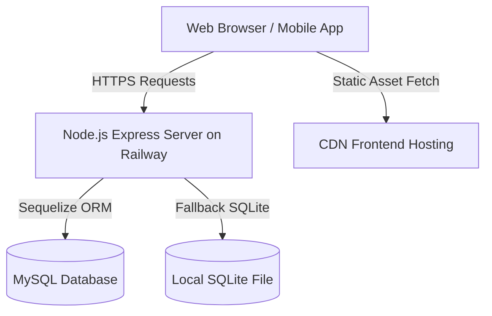

# VIAN ERP - Production Deployment Guide

This guide details the complete production architecture, prerequisite configurations, and steps required to build and deploy the unified VIAN ERP system (Node.js backend + Flutter web/mobile).

## Architecture Overview

VIAN ERP uses a split-tier architecture:
1. **Frontend (SPA Web Portal)**: Built with Flutter Web and deployed as a fast, cached Single Page Application (SPA) on **Netlify**.
2. **Backend (REST & Realtime Server)**: Powered by Node.js, Express, and Sequelize. Deployed on **Railway** with support for SQLite fallback and MySQL.

## Production Requirements

Ensure you have the following accounts and installations before deploying:
- A GitHub repository containing the complete codebase.
- A **Netlify** account (linked to GitHub).
- A **Railway** account (linked to GitHub).
- Production credentials for external services (Google Gemini API, Cloudinary, Gmail SMTP).

## Table of Contents

- [Netlify Deployment Guide](netlify_guide.md)
- [Railway Deployment Guide](railway_guide.md)
- [Environment Variables Configuration](environment_variables.md)
