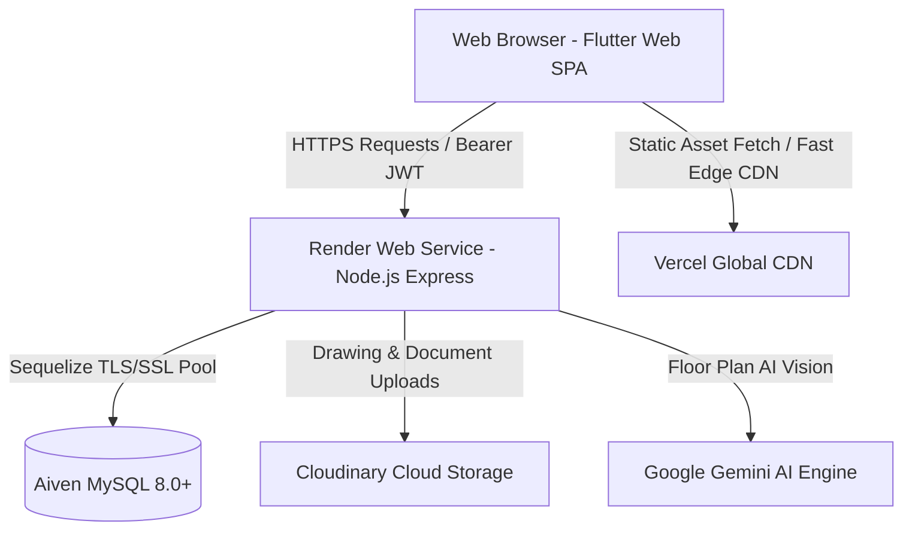

# VIAN ERP - Production Deployment Guide (Vercel + Render + Aiven MySQL)

This guide details the complete production cloud architecture, configuration, and steps required to build and deploy the VIAN ERP system.

---

## Production Architecture Stack

```mermaid
graph TD
    Client[Web Browser - Flutter Web SPA] -->|HTTPS Requests / Bearer JWT| Render[Render Web Service - Node.js Express]
    Client -->|Static Asset Fetch / Fast Edge CDN| Vercel[Vercel Global CDN]
    Render -->|Sequelize TLS/SSL Pool| Aiven[(Aiven MySQL 8.0+)]
    Render -->|Drawing & Document Uploads| Cloudinary[Cloudinary Cloud Storage]
    Render -->|Floor Plan AI Vision| Gemini[Google Gemini AI Engine]
```

1. **Frontend**: [Vercel](https://vercel.com/) hosting the Flutter Web Single Page Application (SPA).
2. **Backend**: [Render](https://render.com/) Web Service running Node.js + Express with Sequelize ORM.
3. **Database**: [Aiven MySQL](https://aiven.io/) managed relational database with enforced TLS/SSL encryption.
4. **File Storage**: [Cloudinary](https://cloudinary.com/) for secure storage of architectural drawings and documents.
5. **AI Processing**: Google Gemini API running on the server for automated civil estimations and floor plan parsing.
6. **Continuous Integration**: GitHub Actions automated pipeline.

---

## Production Prerequisites

Ensure you have created the required cloud resources before deploying:
- A GitHub repository containing the complete codebase.
- A **Vercel** account linked to GitHub.
- A **Render** account linked to GitHub.
- An **Aiven** account with an active MySQL service.
- Production API keys for Google Gemini, Cloudinary, and SMTP credentials.

---

## Quick Reference & Guides

- 🚀 **[Render & Aiven Deployment Guide](render_guide.md)**: Detailed step-by-step setup for Render Web Service and Aiven MySQL.
- 🔑 **[Environment Variables Reference](environment_variables.md)**: Full list of required production environment variables.
- 🌐 **Frontend Configuration**: See [`vercel.json`](../vercel.json) and [`scripts/build_flutter_web.sh`](../scripts/build_flutter_web.sh).
